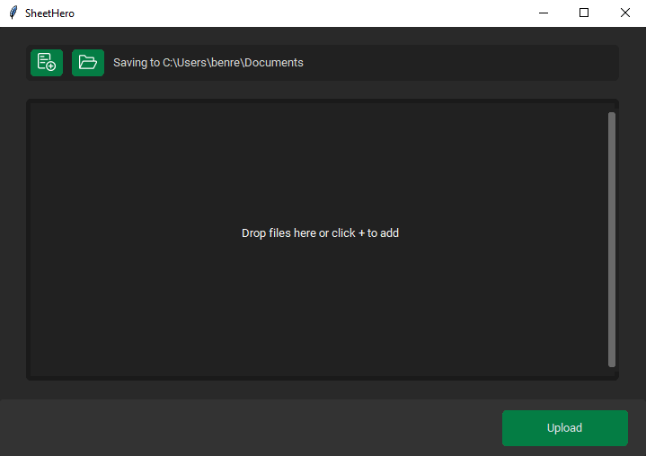
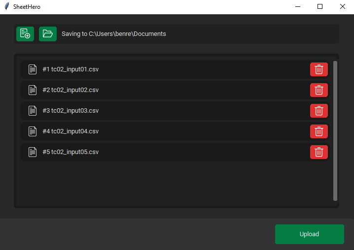
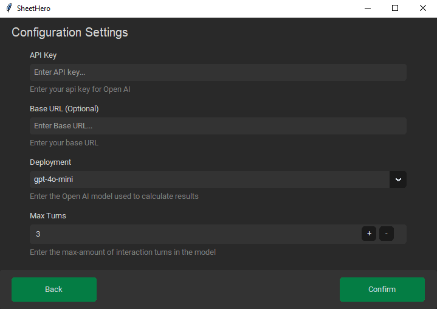
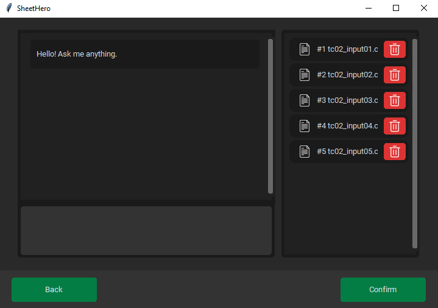
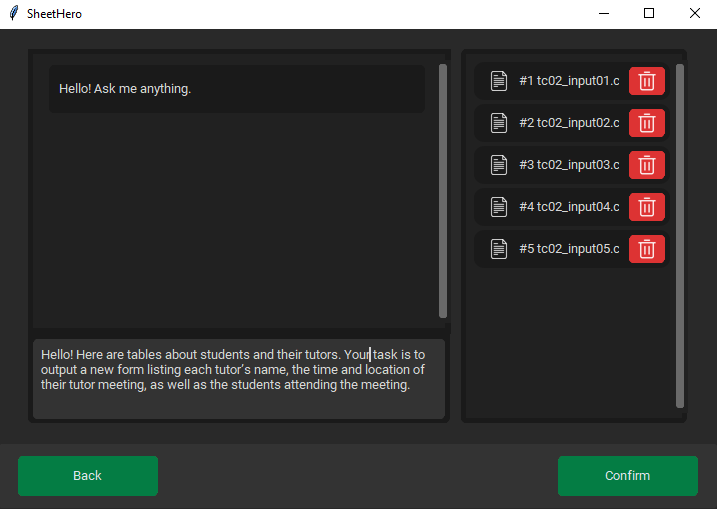
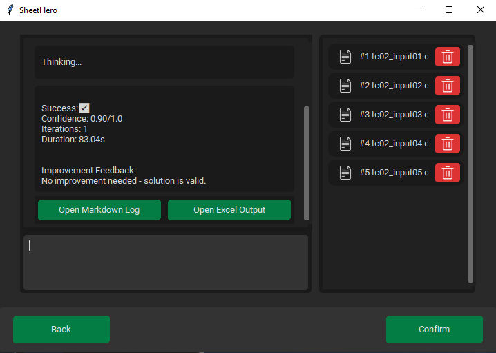

# SheetHero

---


This project provides a **tool to assist users in processing Excel data** using **natural language commands** created by **Team 29**.  
The system uses a **Large Language Model (LLM)** to interpret the user’s prompt and translate it into a sequence of **atomic data manipulation commands** that can be executed automatically.

## Features

---
- `Upload` Excel file formats, which can be done via:
  - `Drag & Drop` files/folders into the software.
  - `Select` files/folders locally.
- `Merge` content from several Excel files, including ones of different formats.
- `Analyse` data from several Excel files, and make a justified conclusion.
- `Configure` the model to user preference, (requires OpenAi API key) including:
  - The `Deployment` choices of the model. Including `gpt-4o-mini` and more
  - The `Max Turns` of the model, defining the max number of iterations SheetHero can perform
  - The `Base URL`, optional custom url. Otherwise, uses [https://api.openai.com/v1](https://api.openai.com/v1)
- Support for `.xlsx`,`.xlsm` `*.xltx` `*xltm` and `.csv` file extensions.
- This program also provides auto-generated and detailed logs of the agents thought-process.
  - These logs are generated after an analysis, provided via buttons inside the prompting-process.

## Preview

SheetHero provides an interactive and easy-to-use guided user interface to support its AI-powered tools, 

---
### Upload

To upload files with SheetHero, either select manually or use the drag & drop support functionality to import 
your files into the menu. Additionally, you can customise the export directory here, to specify where generated files
are located after analysis.





### Configure

To configure SheetHero, simply enter your OpenAi API key and specify any additionally properties before execution
- Base URL is an optional field, used for custom self-hoster or proxy servers
- Deployment of the model, from a variety of choices of OpenAI's current models
- Max Turns is the maximum amount of iterations SheetHero can perform during the analysis.



### Prompt

To prompt with SheetHero, simply type in your prompt to the model, specifying what operations or analysis questions
you would like to perform on the previously selected files. After analysis, you can view the logs of the operation or 
open the generated file through the menu buttons.







### Log Generation


SheetHero provides a `.md` file with the logged analysis and thought process during all phases of its processing.


## Installation

---
TO-DO remove dev branch on release

### Clone the repository
```
git clone --branch dev https://projects.cs.nott.ac.uk/comp2002/2025-2026/team29_project.git
cd team29_project
```

### Linux / macOS Installation
```
python3 -m venv venv
source venv/bin/activate
pip install -r requirements.txt
python main.py
```

### Windows Installation
```
python -m venv venv
venv\Scripts\activate
pip install -r requirements.txt
python main.py
```

## Changelog

---
Changelog with all documented changes to the software is available [here](docs/Changelog.md)