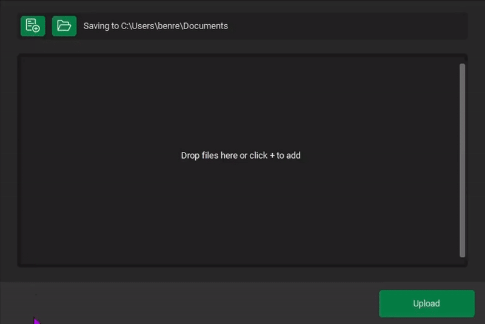
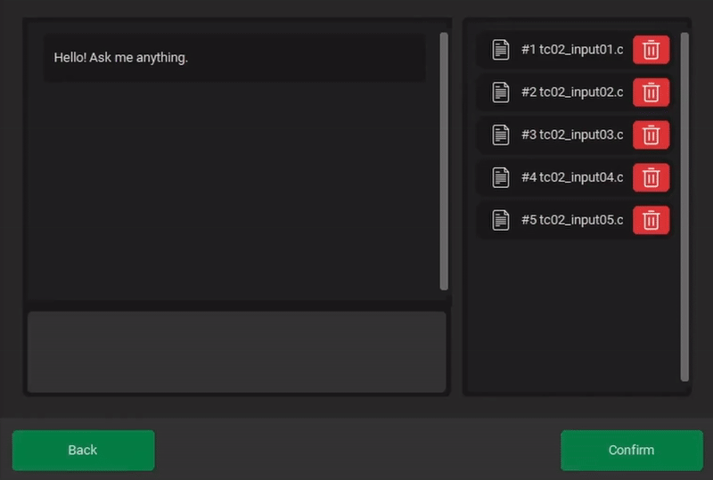

# SheetHero

---


SheetHero is a **tool to assist users in processing Excel data** using **natural language commands** created by **Team 29**.  
The system uses a **Large Language Model (LLM)** to interpret the user’s prompt and translate it into a sequence of **atomic data manipulation commands** that can be executed automatically.

## Features

---
- `Upload` Excel file formats, which can be done via:
  - `Drag & Drop` files/folders into the software.
  - `Select` files/folders locally.
- `Merge` content from several Excel files, including ones of different formats.
- `Analyse` data from several Excel files, and make a justified conclusion.
- `Configure` the model to user preference, (requires OpenAi API key) including:
  - The `Deployment` choices of the model. (e.g., `gpt-4o-mini` and more)
  - The `Max Turns` of the model, defining the max number of iterations SheetHero can perform
  - The `Base URL`, optional custom url. Otherwise, uses [https://api.openai.com/v1](https://api.openai.com/v1)
- Support for `.xlsx`,`.xlsm` `*.xltx` `*xltm` and `.csv` file extensions.
- This program also provides auto-generated and detailed logs of the agents thought-process.
  - These logs are generated after an analysis, provided via buttons inside the prompting-process.

## Preview

SheetHero provides an interactive and easy-to-use guided user interface to support its AI-powered tools, 

---
### Upload

Use drag & drop or manual selection to add files.
The export directory can also be customised for storing generated outputs.



### Configure

Enter your OpenAI API key and configure:
- **Base URL** (optional)
- **Model Deployment**
- **Max Turns**


### Prompt

Ask SheetHero to perform any analysis or transformation on the selected files.
After processing, you can open the output or inspect the verbose log directly.




### Log Generation

SheetHero generates a structured `.md` file documenting the agent’s reasoning, decisions, and execution process.


## Installation

---
TO-DO remove dev branch on release

### Clone the repository
```
git clone --branch dev https://projects.cs.nott.ac.uk/comp2002/2025-2026/team29_project.git
cd team29_project
```

### Linux / macOS
```
python3 -m venv venv
source venv/bin/activate
pip install -r requirements.txt
python main.py
```

### Windows
```
python -m venv venv
venv\Scripts\activate
pip install -r requirements.txt
python main.py
```

## Changelog

---
Changelog with all documented changes to the software is available [here](docs/Changelog.md)