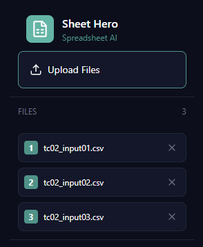
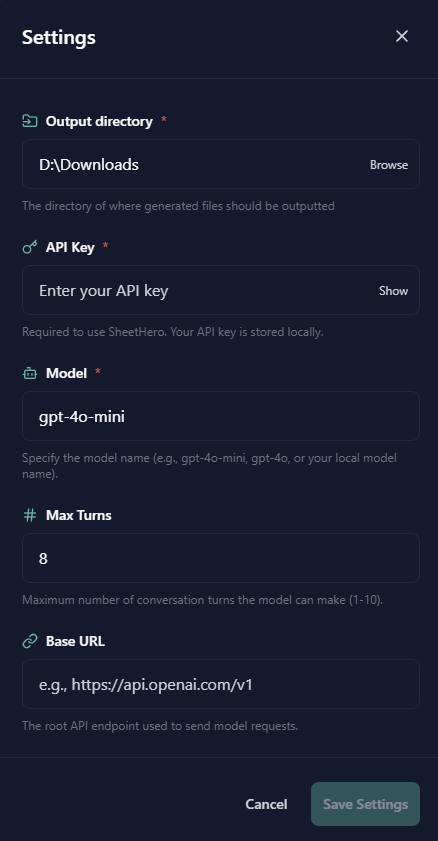
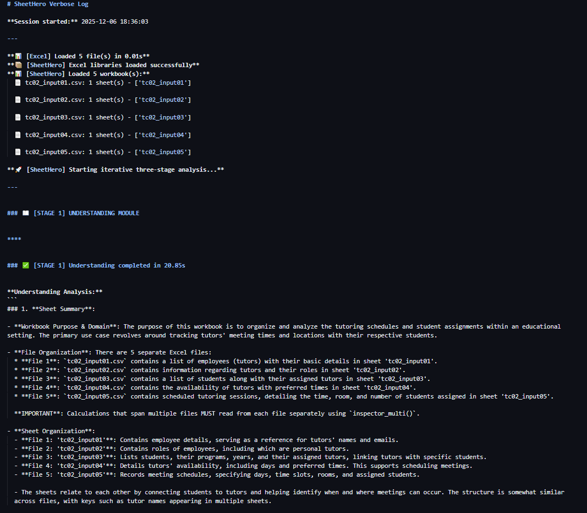

# SheetHero

<p align="center">
  
</p>

<p align="center">
  <strong>Natural Language Processing Interface for Automated Excel Data Manipulation</strong><br/>
  <em>COMP2002 Group Project — Team 29</em>
</p>

<p align="center">
  
  
  
  
</p>

---

## Overview

SheetHero is a desktop application that enables users to perform complex Excel data operations through natural language instructions. The system passes user-defined prompts to a Large Language Model (LLM), which interprets the intent and decomposes it into a sequence of atomic data manipulation commands executed programmatically against the target spreadsheet files.

This approach removes the need for users to write scripts or possess domain knowledge of spreadsheet formula syntax, lowering the barrier to structured data analysis and transformation.

---

## Features

| Feature                 | Description                                                                                           |
| ----------------------- | ----------------------------------------------------------------------------------------------------- |
| **File Ingestion**      | Upload `.xlsx`, `.xlsm`, `.xltx`, `.xltm`, and `.csv` files via drag-and-drop or file picker          |
| **Multi-file Merging**  | Consolidate data from multiple spreadsheets, including files with differing schemas                   |
| **Analytical Querying** | Submit natural language queries across multiple files; receive justified, model-generated conclusions |
| **Model Configuration** | Customise the underlying LLM deployment, iteration limits, and API endpoint                           |
| **Execution Logging**   | Auto-generated Markdown logs documenting the agent's reasoning and decision trace per operation       |

---

## Preview

### File Upload

> Users may add files via manual selection. An optional custom export directory may be specified for all generated outputs.

<p align="center">
  
  <br/><em>Figure 1 — File upload and export directory configuration</em>
</p>

---

### Model Configuration

> Before invoking the agent, users supply an OpenAI-compatible API key and optionally override the base URL, select a model deployment, and set a maximum turn limit to bound execution.

<p align="center">
  
  <br/><em>Figure 2 — Model configuration panel</em>
</p>

---

### Natural Language Prompting

> Users submit a plain-language instruction describing the desired transformation or analysis. SheetHero interprets the request, executes the appropriate operations, and surfaces the output file alongside an optional verbose log.

<p align="center">
  
  <br/><em>Figure 3 — Prompt submission and agent execution</em>
</p>

---

### Execution Log

> Upon completion, SheetHero produces a structured `.md` log file capturing the agent's internal reasoning chain, tool calls, and intermediate decisions. This supports auditability and debugging of complex multi-step operations.

<p align="center">
  
  <br/><em>Figure 4 — Auto-generated execution log</em>
</p>

---

## Installation

### Prerequisites

- Python 3.9 or later
- An OpenAI-compatible API key

### Clone the Repository

```bash
git clone --branch main https://projects.cs.nott.ac.uk/comp2002/2025-2026/team29_project.git
cd team29_project
```

### Linux / macOS

```bash
python3 -m venv venv
source venv/bin/activate
pip install -r requirements.txt
python main.py
```

### Windows

```batch
python -m venv venv
venv\Scripts\activate
pip install -r requirements.txt
python main.py
```

---

## Configuration Reference

| Parameter          | Required | Description                                                  |
| ------------------ | -------- | ------------------------------------------------------------ |
| `API Key`          | Yes      | OpenAI-compatible API key for model access                   |
| `Base URL`         | No       | Custom API endpoint; defaults to `https://api.openai.com/v1` |
| `Model Deployment` | Yes      | Target model identifier (e.g. `gpt-4o-mini`)                 |
| `Max Turns`        | Yes      | Maximum number of agent iterations per request               |

---

## Supported File Formats

| Extension | Format                       |
| --------- | ---------------------------- |
| `.xlsx`   | Excel Workbook               |
| `.xlsm`   | Excel Macro-Enabled Workbook |
| `.xltx`   | Excel Template               |
| `.xltm`   | Excel Macro-Enabled Template |
| `.csv`    | Comma-Separated Values       |

---

## Changelog

A full changelog of documented modifications is available in [`docs/Changelog.md`](docs/Changelog.md).
