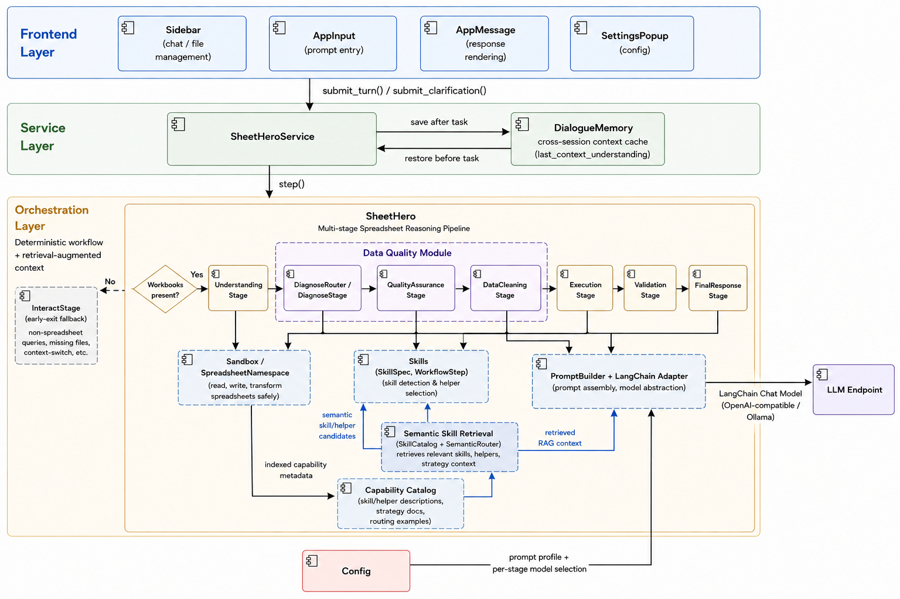
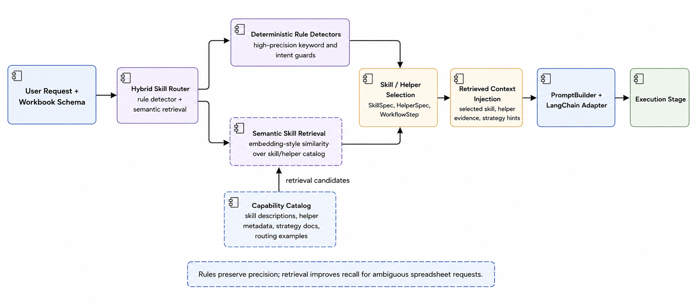
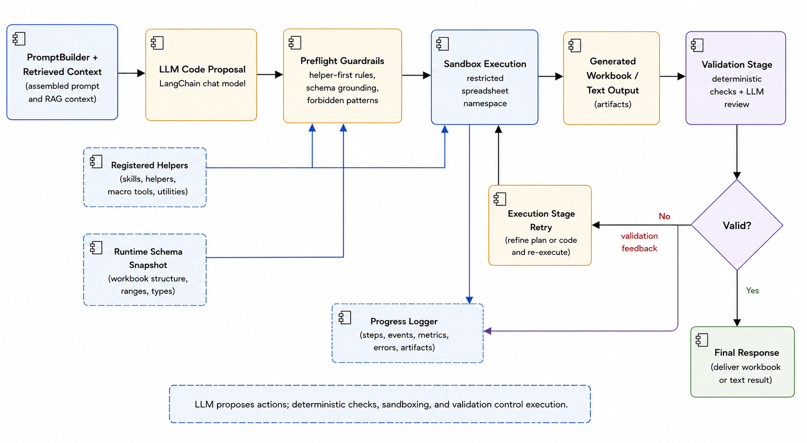
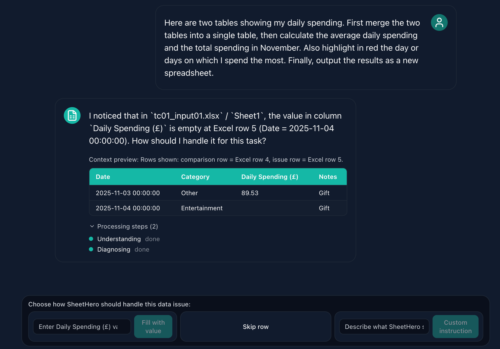

# SheetHero

<p align="center">
  
</p>

<p align="center">
  <strong>面向电子表格自动化的技能引导自然语言 Agent</strong><br/>
  <em>UoN COMP2002 Group Project — Team 29</em>
</p>

<p align="center">
  <em>Team 29 小组项目的个人 GitHub 归档版本，并扩展了 LangChain、语义检索和受控执行流程。</em>
</p>

<p align="center">
  <a href="README.md">English README</a>
</p>

<p align="center">
  
  
  
  
  
  
  
  
</p>

---

## 项目简介

SheetHero 是一个桌面端电子表格自动化应用。用户可以用自然语言描述想要完成的 Excel/CSV 操作，系统会结合 LLM、表格 schema、技能路由、辅助函数、QA 澄清、预执行检查和确定性验证来完成任务，尽量减少用户手写 Python 或 Excel 公式的需求。

当前版本支持多文件合并、分组汇总、依赖调度、QA 辅助数据清洗，以及全表 Pearson 相关性分析等任务。

---

## 工作机制

SheetHero 采用分层架构：React/Electron 前端负责文件管理、配置和对话入口；服务层负责保存和恢复跨轮上下文；后端 Agent 通过固定的电子表格推理流水线执行任务。

LLM 层使用 LangChain 适配器接入 OpenAI-compatible chat model，同时保留项目原本的确定性阶段边界。系统还加入了轻量 retrieval layer：用户请求会和技能、helper、策略说明组成的 capability catalog 做语义匹配，然后将检索到的 RAG context 注入执行提示词。这不是普通 PDF 问答式 RAG，而是面向电子表格 workflow 的 retrieval-augmented agent 设计。

<p align="center">
  
  <br/><em>图 1 — SheetHero 架构：LangChain 模型适配、语义技能检索和受控执行流水线。</em>
</p>

### Retrieval-Augmented Skill Routing

SheetHero 同时使用确定性规则检测和语义检索。规则检测负责高精度识别明确任务，语义检索负责在模糊请求中召回相关技能、helper 和策略上下文。

<p align="center">
  
  <br/><em>图 2 — 混合技能路由：规则保持精度，语义检索提升模糊表格请求的召回能力。</em>
</p>

### Controlled Execution and Validation

SheetHero 不是直接让 LLM 任意操作文件。LLM 提出代码或操作计划后，系统会通过 helper-first guardrails、运行时 schema、沙盒执行、日志记录和验证阶段来约束执行过程。

<p align="center">
  
  <br/><em>图 3 — 受控执行闭环：LLM 生成动作，系统通过 guardrails、沙盒和验证控制结果质量。</em>
</p>

---

## 核心功能

| 功能 | 说明 |
| --- | --- |
| **文件导入** | 支持通过桌面文件选择器上传 `.xlsx`、`.xlsm`、`.xltx`、`.xltm` 和 `.csv` 文件 |
| **多文件工作流** | 用自然语言完成 join、merge、aggregate、schedule 和 analysis 等多文件任务 |
| **交互式 QA** | 发现缺失值、异常数值等数据质量问题时，向用户提出结构化澄清问题 |
| **技能和 Helper 执行** | 将请求路由到合适的 spreadsheet skill、helper、运行计划和预执行保护规则 |
| **语义技能检索** | 使用 LangChain-oriented retrieval context，将请求匹配到技能和 helper 描述 |
| **统计分析** | 支持回归和相关性分析，包含全表读取、缺失值处理和类别特征编码 |
| **停止执行** | 用户可以中断前端正在等待的 agent 请求 |
| **执行日志** | 在 `artifacts/loggers/` 下生成结构化 Markdown 日志，便于调试和复盘 |

---

## 界面预览

### 文件上传

用户可以手动选择文件，并为生成结果设置自定义输出目录。

<p align="center">
  
  <br/><em>图 4 — 文件上传和输出目录配置</em>
</p>

### 模型配置

用户需要提供 OpenAI-compatible API key，也可以设置 base URL、模型名称和最大执行轮数。

<p align="center">
  
  <br/><em>图 5 — 模型配置面板</em>
</p>

### 自然语言任务输入

用户用一句自然语言描述希望完成的表格操作，SheetHero 会解析任务、执行对应操作，并返回输出文件和简短结果摘要。

<p align="center">
  
  <br/><em>图 6 — Prompt 输入和 Agent 执行</em>
</p>

### 交互式 QA

当输入数据中存在会影响任务结果的问题时，SheetHero 会展示数据预览并询问用户如何处理，例如填补缺失值、跳过异常行或保留原始数据。

<p align="center">
  
  <br/><em>图 7 — 数据质量问题的交互式澄清</em>
</p>

### 执行日志

每次运行都会在 `artifacts/loggers/` 下写入 Markdown 日志，记录 workbook context、阶段切换、QA 决策、生成代码、预执行反馈、执行输出、验证结果和最终总结。

<p align="center">
  
  <br/><em>图 8 — 自动生成的执行日志</em>
</p>

---

## 安装方式

### 前置要求

- Python 3.9 或更高版本
- Node.js 18 或更高版本
- npm
- OpenAI-compatible API key

### 克隆项目

```bash
git clone https://github.com/KunChen1110/SheetHero.git
cd SheetHero
```

### Linux / macOS

```bash
python -m venv venv
source venv/bin/activate
pip install -r requirements.txt

cd frontend
npm install
cd ..

python main.py
```

### Windows

```batch
python -m venv venv
venv\Scripts\activate
pip install -r requirements.txt

cd frontend
npm install
cd ..

python main.py
```

`python main.py` 会启动 FastAPI 后端、Vite 前端服务和 Electron 桌面窗口。

### 后端 CLI

用于命令行调试和 benchmark：

```bash
python -m backend.main
```

常用命令：

```text
!llm --show
!llm --switch--offline qwen3:8b
!dataset --index 6
!benchmark dev --index 6
!judge dev --index 6
```

---

## 配置说明

| 参数 | 是否必需 | 说明 |
| --- | --- | --- |
| `API Key` | 是 | 用于调用 hosted model 的 OpenAI-compatible API key |
| `Base URL` | 否 | 留空则使用 OpenAI；也可以填 Ollama 等本地 OpenAI-compatible endpoint |
| `Model Deployment` | 是 | 模型名称，例如 `gpt-4o-mini` 或 `qwen3:8b` |
| `Max Turns` | 是 | 单次任务允许的最大执行轮数 |
| `Output Directory` | 是 | 生成表格的输出目录，默认通常为 Documents |
| `Output Mode` | 否 | `file` 输出 Excel 文件；启用 text mode 时返回文本预览 |

### 在线模式

`Base URL` 留空，并提供 OpenAI API key。

不要把 API key 提交到仓库。推荐在应用配置面板中输入，或通过环境变量传入：

```bash
export SHEETHERO_API_KEY="your-api-key"
```

### 离线模式

先启动本地模型服务，然后将 `Base URL` 设置为 OpenAI-compatible endpoint：

```bash
ollama run qwen3:8b
```

示例 base URL：

```text
http://localhost:11434/v1
```

---

## 输出和日志

| 产物 | 位置 | 说明 |
| --- | --- | --- |
| 生成的 workbook | 用户配置的输出目录，通常是 Documents | file mode 下每次运行生成一个 workbook |
| SheetHero 运行日志 | `artifacts/loggers/sheethero_*.md` | 主执行链路日志 |
| LLM prompt dump | `artifacts/loggers/llm_*.md` | 开启调试时保存的 prompt/input 记录 |
| CLI benchmark 输出 | `artifacts/output/` | 后端 CLI benchmark 使用 |

---

## 项目结构

```text
SheetHero/
├── backend/              # Agent pipeline, service layer, prompts, skills, sandbox, validation
├── frontend/             # Electron + React user interface
├── dataset/              # Development, diagnosis, and system evaluation benchmark cases
├── test/                 # Unit, integration, and benchmark test runners
├── docs/                 # Changelog, design notes, research notes, and data-cleaning documentation
├── assets/README/        # README 图片资源
├── artifacts/loggers/    # SheetHero 运行时生成的 Markdown 日志
├── artifacts/output/     # CLI benchmark 和生成结果
├── main.py               # 后端、前端和 Electron 的根启动器
└── requirements.txt      # Python 依赖
```

---

## 支持的文件格式

| 扩展名 | 格式 |
| --- | --- |
| `.xlsx` | Excel Workbook |
| `.xlsm` | Excel Macro-Enabled Workbook |
| `.xltx` | Excel Template |
| `.xltm` | Excel Macro-Enabled Template |
| `.csv` | Comma-Separated Values |

---

## 更多文档

| 文档 | 作用 |
| --- | --- |
| [`docs/ProjectPositioning.md`](docs/ProjectPositioning.md) | 项目范围、目标任务类型、支持的数据问题和取舍 |
| [`docs/SoftwareDesign.md`](docs/SoftwareDesign.md) | 当前分层设计、pipeline stage、skill/helper 执行和 QA flow |
| [`docs/VersionHistory.md`](docs/VersionHistory.md) | 从原型到 skill-guided system 的主要架构演进 |
| [`docs/Changelog.md`](docs/Changelog.md) | 具体实现层面的变更记录 |
