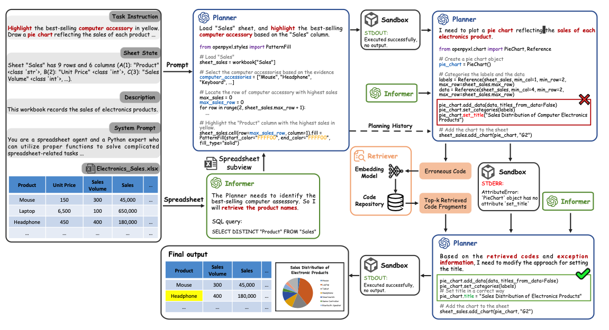
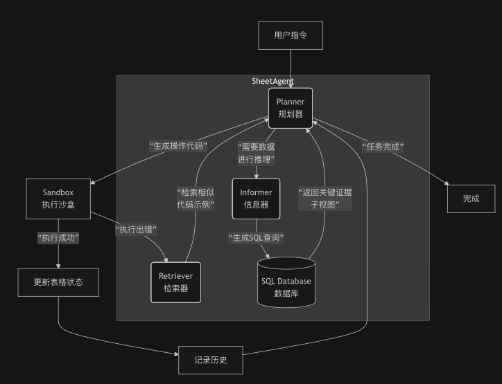
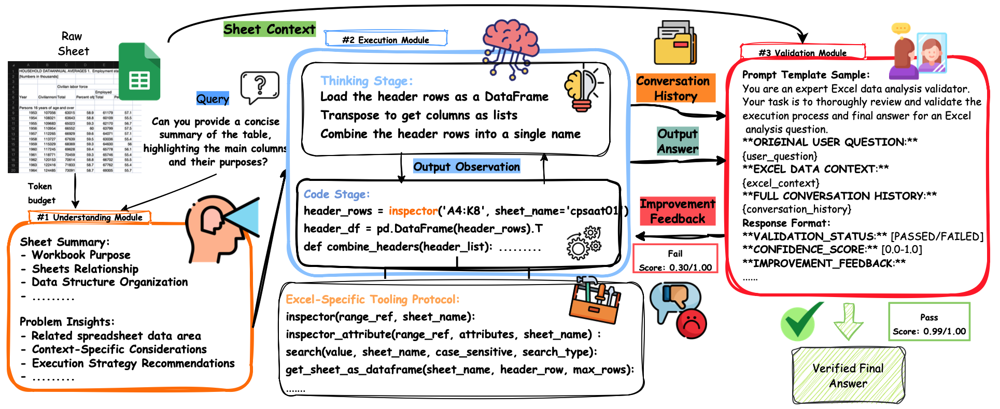
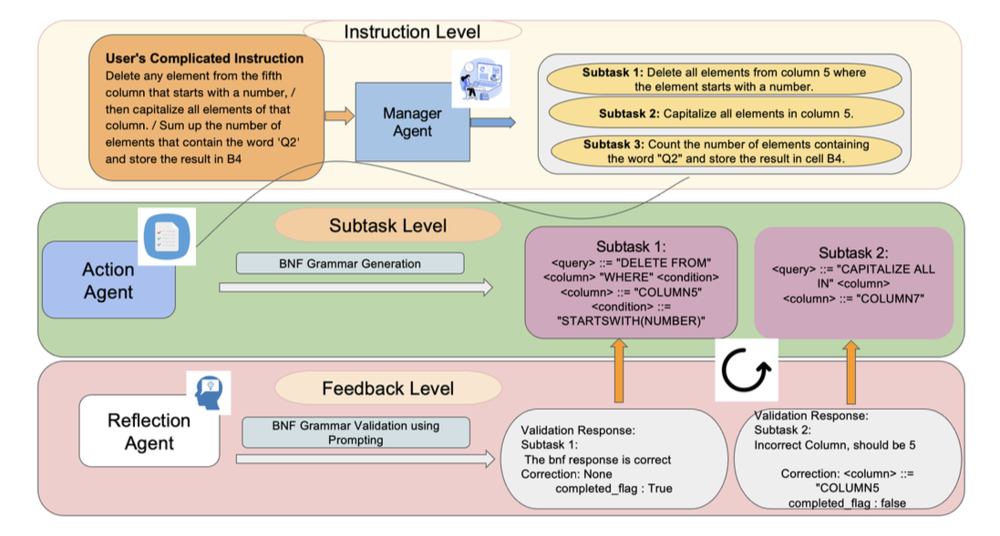

# CONCERN

- Framework of system
- python code / excel formula / BNF
- Utilization of SQL
- Self evaluation
- Feedback mechanism
- Evaluation method (Benchmark / Dataset)
- Inconsistent / Incomplete / Wrong data cleaning

# Paper

## Can an LLM find its way around a Spreadsheet? (Kun)

- [Notes](./PaperNotes/LLM_find_its_way.md)
- Info
  - Year: 2024
  - Paper of Master Degree
  - Citation: 1
- Abstract
  - Data cleaning: Make LLM an automated data preprocessing assistant
  - No code provided
  - Low quality?

## SheetAgent: Towards a Generalist Agent for Spreadsheet Reasoning and Manipulation via Large Language Models (BW)

- [Notes](./PaperNotes/SheetAgent.md)
- Info
  - Year: 2024(openview) / 2025(arxiv)
  - arxiv
  - Citation: 15 + 6
- Abstract
  - Framework
    
    
  - Generating python code
  - Using SQL to avoid reading all data in file (just columns)
  - Self fixing by Retriver

## SheetBrain: A Neuro-Symbolic Agent for Accurate Reasoning over Complex and Large Spreadsheets (XZ)

- [Notes](./PaperNotes/SheetBrain.md)
- Info
  - Year: 2025
  - arxiv
  - Citation: 0
- Abstract
  - Framework
    
  - High quality？ (CMU, ZJU, Cambridge, Microsoft)
  - Implements feedback mechanisms - retrieval-based fixing, validation modules, or multi-agent evaluation loops
  - Generating python code to operate on dataframe, not excel formula and with some using SQL for efficient column filtering

## SheetCopilot: Bringing Software Productivity to the Next Level through Large Language Models (KUN / XZ)

- [Notes](./PaperNotes/SheetCopilot.md)
- Info
  - Year: 2023
  - Neurip
  - Citation: 79
- Abstract
  - Framework
  - The earlier research of this area, many other research have done based on this

## SHEETMIND: AN END-TO-END LLM-POWERED MULTI-AGENT FRAMEWORK FOR SPREADSHEET AUTOMATION (EOI)

- [Notes](./PaperNotes/SheetMind.md)
- Info
  - Year: 2025
  - arxiv
  - Citation: 0
- Abstract
  - Framework
    
  - High quality?
  - Divide task into substasks
  - Generating structured commands with Backus-Naur Form (BNF)
  - Self evaluation and fixing

## Sheetpedia: A 300K-Spreadsheet Corpus for Spreadsheet Intelligence and LLM Fine-Tuning (BW)

- [Notes](./PaperNotes/SheetPedia.md)
- Info
  - Year: 2025
  - openview
  - Citation: 0
- Abstract
  - Huge scale, multi area benchmark
  - 2 tasks
    - Map Natural Language to correct excel cell range
    - Generate a grammatically correct and semantically accurate Excel formula based on the user's natural language

## SODBench: A Large Language Model Approach to Documenting Spreadsheet Operations (BW)

- [Notes](./PaperNotes/SODBench.md)
- Info
  - Year: 2025
  - arxiv
  - Citation: 0
- Abstract
  - Use LLMs to automatically generate human-readable documentation from the actions performed in a spreadsheet
  - Maybe useful for feedback mechanism of our system

## SPREADSHEETBENCH: Towards Challenging Real World Spreadsheet Manipulation (BW)

- [Notes](./PaperNotes/SpreadSheetBench.md)
- Info
  - Year: 2024
  - Neurip
  - Citation: 22
- Abstract
  - A benchmark to test system performance

## TabulaX: Leveraging Large Language Models for Multi-Class Table Transformations (Kun)

- [Notes](./PaperNotes/TabulaX.md)
- Info
  - Year: 2024
  - arxiv
  - Citation: 3
- Abstract
  - Data cleaning

# Summarise

## Dataset

- [SpreadsheetBench dataset](https://github.com/RUCKBReasoning/SpreadsheetBench/tree/main/data)
- [SODBench dataset](https://figshare.com/s/1478ca752907477c4e4d?file=56564339)
- [RealHiTBench](https://github.com/cspzyy/RealHiTBench)
- [MultiHiertt](https://github.com/psunlpgroup/MultiHiertt)
